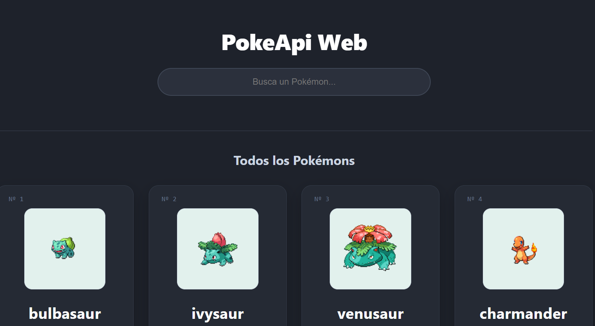
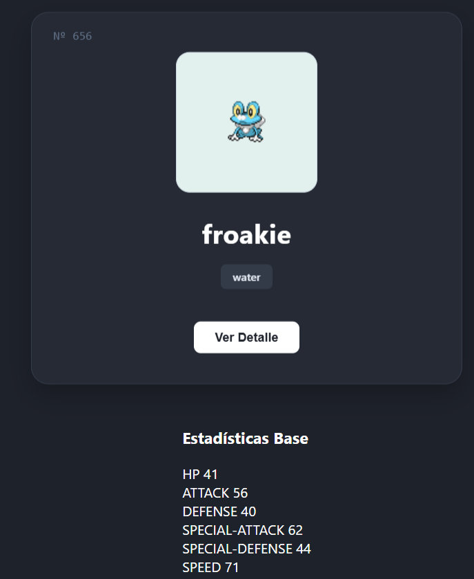

# PokéAPI Web Search 🦖🔥

Aplicación web desarrollada en **Spring Boot** que consume la **PokéAPI** pública para buscar y mostrar estadísticas, tipos y habilidades de Pokémon en tiempo real.

## Demo En Vivo

**[Prueba la aplicación aquí](https://pokeapi-web.onrender.com)** *(Desplegado en Render con Docker)*

---

## Capturas de Pantalla

### Buscador Principal
<p align="center">
  
</p>

### Detalle del Pokémon
<p align="center">
  
</p>

---

## Características y Tecnologías

* **Backend:** Java 17 y Spring Boot (Spring Web) bajo patrón **MVC**.
* **Frontend:** Plantillas HTML dinámicas con **Thymeleaf**.
* **Datos:** Parseo de respuestas JSON con la librería **Gson** (v2.10.1).
* **Despliegue:** Contenerización nativa con **Docker** (Dockerfile multi-stage).
* **Hosting:** Servidor en la nube con **Render**.

## Dockerfile Utilizado

```dockerfile
FROM maven:3.8.5-openjdk-17 AS build
COPY . .
RUN mvn clean package -DskipTests

FROM eclipse-temurin:17-jdk-alpine
COPY --from=build /target/PokeApi_Web-1.0-SNAPSHOT.jar app.jar
EXPOSE 8080
ENTRYPOINT ["java", "-jar", "app.jar"]
